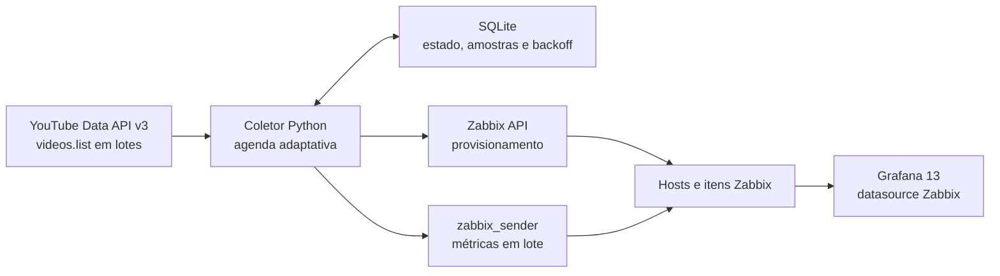

# YouTube Live Monitor

Monitoramento de transmissões públicas do YouTube com **YouTube Data API v3**, **Zabbix** e **Grafana 13**.

O coletor usa apenas `videos.list`, agrupa até 50 IDs por chamada, reduz a frequência de consulta de lives agendadas e interrompe a coleta após o encerramento. Pico, média, agenda de consultas e contadores de saúde sobrevivem a reinicializações no SQLite. O dashboard separa cada live em uma linha repetida, mesmo quando várias transmissões estão ao vivo ao mesmo tempo.

> O projeto não coleta chat, não baixa vídeos e não contorna transmissões privadas. Use apenas IDs públicos e respeite os termos e a quota da API do YouTube.

## Recursos

- Coleta ao vivo a cada 15 segundos por padrão.
- Consulta adaptativa de lives agendadas, mais frequente conforme o início se aproxima.
- Uma chamada `videos.list` para até 50 vídeos que estejam prontos para consulta.
- Backoff persistente para erros e nenhuma nova consulta após a coleta final de uma live encerrada.
- IDs e URLs `watch`, `youtu.be`, `youtube.com/live`, `shorts` e `embed`.
- Lista externa `lives.yaml`, com ativação individual e compatibilidade com a lista antiga no `config.yaml`.
- Um host Zabbix por canal, itens separados pelo `video_id` e host interno para a saúde do coletor.
- Dashboard Grafana 13 transparente, com filtros múltiplos, linhas repetidas e seleção `All`.
- Migração automática do banco da versão 1.2.0, instalador idempotente, systemd endurecido e logrotate.
- Nenhuma credencial, UID de datasource ou dado de uma instância real nos arquivos versionados.

## Arquitetura



## Compatibilidade

- Ubuntu Server 24.04 LTS, alvo do instalador.
- Python 3.12 ou superior.
- Zabbix 7.0 ou superior.
- Grafana 13, pois o dashboard usa o formato V2 Resource.
- Plugin Grafana **Zabbix by Alexander Zobnin** e um datasource Zabbix configurado.

Versões pré-lançamento do Zabbix geram aviso e devem ser validadas em homologação. Outros sistemas podem ser testados explicitamente com `--allow-unsupported`.

## Instalação rápida

```bash
git clone https://github.com/OWNER/youtube-live-monitor.git
cd youtube-live-monitor
sudo ./install.sh
```

Antes de alterar o sistema, o instalador mostra versões, arquivos encontrados e o plano. Ele instala apenas dependências ausentes e preserva `config.yaml` e `lives.yaml` existentes.

Opções:

```text
--yes                 não solicita confirmação
--allow-unsupported   permite testar fora da plataforma suportada
```

## Configuração

Edite `/etc/youtube-live-monitor/config.yaml`:

```yaml
youtube:
  api_key: SUA_API_KEY

collector:
  interval: 15
  timeout: 10
  retries: 2
  batch_size: 50
  unknown_interval: 300
  error_backoff_initial: 300
  error_backoff_max: 3600
  schedule_poll:
    more_than_24h: 21600
    more_than_6h: 3600
    more_than_1h: 900
    more_than_15m: 300
    near_start: 60
    overdue: 30

zabbix:
  server: 127.0.0.1
  port: 10051
  api_url: https://zabbix.exemplo.com/zabbix/api_jsonrpc.php
  api_token: SEU_TOKEN_DA_API_ZABBIX
  sender_path: /usr/bin/zabbix_sender
  verify_tls: true
  tls_connect: unencrypted

lives_file: /etc/youtube-live-monitor/lives.yaml
```

Use em `api_url` o DNS presente no certificado TLS. Não desative a verificação para contornar incompatibilidade de hostname.

As transmissões ficam em `/etc/youtube-live-monitor/lives.yaml`:

```yaml
lives:
  - url: AbCdEfGhI12
    enabled: true

  - url: https://youtu.be/XXXXXXXXXXX
    enabled: true

  - url: https://www.youtube.com/watch?v=YYYYYYYYYYY
    enabled: false
```

`enabled` deve ser o booleano `true` ou `false`, sem aspas. Uma entrada desabilitada não chama a API do YouTube. Para aplicar alterações, reinicie o serviço.

Variáveis de ambiente substituem o YAML:

- `YOUTUBE_API_KEY`
- `YOUTUBE_LIVES_FILE`
- `ZABBIX_SERVER`
- `ZABBIX_PORT`
- `ZABBIX_API_URL`
- `ZABBIX_API_TOKEN`

Elas podem ficar em `/etc/youtube-live-monitor/environment`, com permissão `0640` e proprietário `root:youtube-monitor`. Não versione o arquivo real.

## Política adaptativa de quota

Cada live habilitada é consultada uma vez para descobrir seu estado e horário. Depois disso, o próximo acesso é agendado conforme a distância do início:

| Situação | Intervalo padrão |
|---|---:|
| Mais de 24 horas | 6 horas |
| Entre 6 e 24 horas | 1 hora |
| Entre 1 e 6 horas | 15 minutos |
| Entre 15 e 60 minutos | 5 minutos |
| Até 15 minutos | 1 minuto |
| Horário vencido, mas ainda agendada | 30 segundos |
| Ao vivo | 15 segundos |
| Encerrada | nenhuma nova consulta |
| Erro | 5, 10, 20, 40 e até 60 minutos |

Todos os IDs prontos para consulta são agrupados em lotes de até `batch_size` 50. Como `videos.list` aceita IDs separados por vírgula e custa uma unidade por chamada, 30 lives simultâneas no mesmo lote custam uma unidade por ciclo, não 30.

O estado da agenda e do backoff fica em `state.db`, então reiniciar o processo não elimina a economia. O modo `--test` ignora a agenda e consulta todas as entradas habilitadas uma vez, deliberadamente.

## Validar e iniciar

Valide somente os arquivos:

```bash
sudo -u youtube-monitor /opt/youtube-live-monitor/venv/bin/python \
  /opt/youtube-live-monitor/youtube_live_monitor.py \
  --config /etc/youtube-live-monitor/config.yaml --check-config
```

Consulte todas as lives uma vez, sem provisionar ou enviar ao Zabbix:

```bash
sudo -u youtube-monitor /opt/youtube-live-monitor/venv/bin/python \
  /opt/youtube-live-monitor/youtube_live_monitor.py \
  --config /etc/youtube-live-monitor/config.yaml \
  --database /var/lib/youtube-live-monitor/state.db --test
```

Ative o serviço:

```bash
sudo systemctl restart youtube-live-monitor
sudo systemctl status youtube-live-monitor --no-pager -l
sudo tail -f /var/log/youtube-live-monitor/monitor.log
```

`--once` executa um ciclo completo. `--test` e `--once` retornam código diferente de zero quando houver falha.

## Métricas por live

| Item | Origem ou cálculo |
|---|---|
| `concurrent_viewers` | `liveStreamingDetails.concurrentViewers`, quando público |
| `peak_viewers` / `peak_timestamp` | maior amostra válida e seu instante |
| `average_viewers` | média das amostras coletadas enquanto ao vivo |
| `viewer_change_per_minute` | diferença normalizada contra aproximadamente 60 segundos antes |
| `viewer_change_percent` | variação percentual contra a mesma amostra |
| `total_views` / `new_views_per_minute` | `statistics.viewCount` e sua diferença não negativa |
| `like_count` / `likes_per_minute` | `statistics.likeCount` e sua diferença não negativa |
| `comment_count` | `statistics.commentCount`, quando público |
| `engagement_rate` | curtidas ÷ visualizações × 100 |
| `elapsed_seconds` | duração ao vivo ou duração final |
| `scheduled_delay_seconds` | início real − início agendado; negativo significa início antecipado |
| `time_to_peak_seconds` | tempo entre início real e pico observado |
| `viewer_count_available` | `1` quando a audiência simultânea está exposta, senão `0` |
| `status` | `0` desconhecida, `1` agendada, `2` ao vivo, `3` encerrada |

Também são enviados título, canal, IDs, horários agendados/reais, última atualização, latência e HTTP status. Lives agendadas enviam apenas estado e metadados; valores de audiência só entram no histórico quando a live está ao vivo. Curtidas, comentários e audiência podem ser omitidos pelo YouTube ou pelo proprietário do vídeo. A API pública não fornece contagem pública de dislikes.

## Saúde do coletor

O host técnico `youtube-live-monitor-collector`, no grupo `YouTube Live Monitor Internal`, recebe:

- chamadas da API totais e do dia UTC;
- vídeos por chamada, consultas adaptativas evitadas e duração do ciclo;
- idade do último sucesso, maior sequência de erros e falhas do `zabbix_sender`;
- tamanho do banco e quantidade de lives habilitadas, agendadas, ao vivo e encerradas.

Esses objetos ficam fora do grupo usado pela variável `Canal`, portanto não poluem o filtro das transmissões.

## Zabbix e Grafana

Na primeira coleta, o token Zabbix cria ou reutiliza o grupo/template `YouTube Live Monitor`, o value mapping, um host `youtube-channel-<channel_id>` por canal e os itens trapper por vídeo. Itens existentes são reutilizados de forma idempotente.

O instalador provisiona o dashboard V2 em `/var/lib/grafana/dashboards/youtube-live-monitor/dashboard.json`, mantendo um backup datado do anterior. O dashboard enviado com o projeto não contém datasource UID nem metadados da instância usada em seu desenvolvimento.

- `Canal = All` e `Live = All`: uma seção completa por live, em todos os canais.
- Um canal e `Live = All`: uma seção para cada live daquele canal.
- A seção **Saúde do coletor** não é repetida.
- A atualização automática é de 15 segundos.

Após a primeira abertura, selecione o datasource na variável `Zabbix` e salve o dashboard se quiser torná-lo o padrão local.

## Limitações da API pública

Dados de integridade do stream, bitrate, resolução de ingest, erros de codificador e chat ao vivo exigem APIs autenticadas e autorização do canal proprietário. Por isso não fazem parte deste projeto de monitoramento de lives públicas. Atrasos de atualização também podem ocorrer na própria YouTube Data API.

## Diagnóstico

```bash
sudo systemctl status zabbix-server grafana-server youtube-live-monitor
sudo journalctl -u youtube-live-monitor --since "30 minutes ago" --no-pager
sudo tail -n 100 /var/log/youtube-live-monitor/monitor.log
sudo -u youtube-monitor test -r /etc/youtube-live-monitor/config.yaml
sudo -u youtube-monitor test -r /etc/youtube-live-monitor/lives.yaml
sudo -u youtube-monitor test -w /var/lib/youtube-live-monitor
```

Erros de certificado devem ser corrigidos com o DNS correto em `zabbix.api_url` ou um certificado com SAN adequado. Erros persistentes usam backoff; uma live com falha não interrompe as demais.

## Atualização e desinstalação

Configuração, lista de lives e banco são preservados durante a atualização:

```bash
git pull --ff-only
sudo ./install.sh
```

```bash
sudo ./uninstall.sh          # preserva dados
sudo ./uninstall.sh --purge  # remove dados locais
```

Objetos e histórico do Zabbix não são apagados automaticamente.

## Desenvolvimento

```bash
python3 -m venv .venv
. .venv/bin/activate
pip install -r requirements.txt -r requirements-dev.txt
make check
```

Consulte [CONTRIBUTING.md](CONTRIBUTING.md), [SECURITY.md](SECURITY.md) e [CHANGELOG.md](CHANGELOG.md).

## Referências

- [YouTube Data API — `videos.list`](https://developers.google.com/youtube/v3/docs/videos/list)
- [YouTube Data API — recurso `video`](https://developers.google.com/youtube/v3/docs/videos)
- [YouTube Data API — quota](https://developers.google.com/youtube/v3/determine_quota_cost)
- [Zabbix — `zabbix_sender`](https://www.zabbix.com/documentation/current/en/manpages/zabbix_sender)
- [Grafana — dashboard JSON model](https://grafana.com/docs/grafana/latest/visualizations/dashboards/build-dashboards/view-dashboard-json-model/)
- [Grafana — plugin Zabbix](https://grafana.com/grafana/plugins/alexanderzobnin-zabbix-app/)

## Licença

Distribuído sob a licença MIT. Consulte [LICENSE](LICENSE).

YouTube, Zabbix e Grafana são marcas de seus respectivos proprietários. Este projeto comunitário não é afiliado, patrocinado nem endossado por essas organizações.
